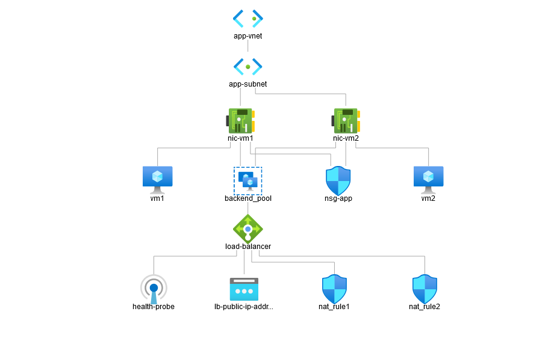

# Docker Project Infrastructure
## We Create a project that uses Terraform to build the infrastructure for our Docker project.

### This time we only create two VMs for each environment.
### We also added "remote-exec" to the VMs module to automatically install Docker. 

## Virtual Network Diagram


## How to use?

## 1- Install Terraform (https://learn.hashicorp.com/tutorials/terraform/install-cli?in=terraform/aws-get-started)

## 2- Create azure account
## 3- Install the Azure CLI and authenticate with Azure with the following command:
#     `az login`
## 4- Clone the project: (https://github.com/af009/ansible-project)
## 5- Create a file called terraform-stage.tfvars in the root folder
```
environment_name = "staging"
vm_size          = "Standard_B1ms"
admin_username   = "your username"
admin_password   = "your password"
PGUSERNAME       = "your postgres username"
PGDATABASE       = "your postgres db name"
PGPASSWORD       = "your postgres password"
location         = "your location"
```

## 6- Create a file called terraform-prod.tfvars in the root folder
```
environment_name = "production"
vm_size          = "Standard_B2ms"
admin_username   = "your username"
admin_password   = "your password"
PGUSERNAME       = "your postgres username"
PGDATABASE       = "your postgres db name"
PGPASSWORD       = "your postgres password"
location         = "your location"
```


## 7- Create two workspaces (staging and production)
```
terraform workspace new "staging" 
terraform workspace new "production"
```


## 8- Run the following commands:
```
//select workspace
terraform workspace select staging
// init
terraform init
// plan
terraform plan --var-file=terraform-stage.tfvars
// apply
terraform apply --var-file=terraform-stage.tfvars -auto-approve
```
## 9- Like point 8 but this time with production parameters:
```
//select workspace
terraform workspace select production
// init
terraform init
// plan
terraform plan --var-file=terraform-prod.tfvars
// apply
terraform apply --var-file=terraform-prod.tfvars -auto-approve
```
## 10- Terraform part is done! 
